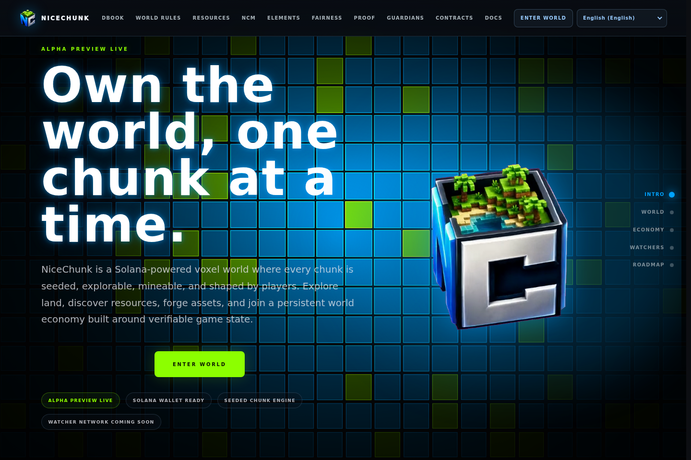
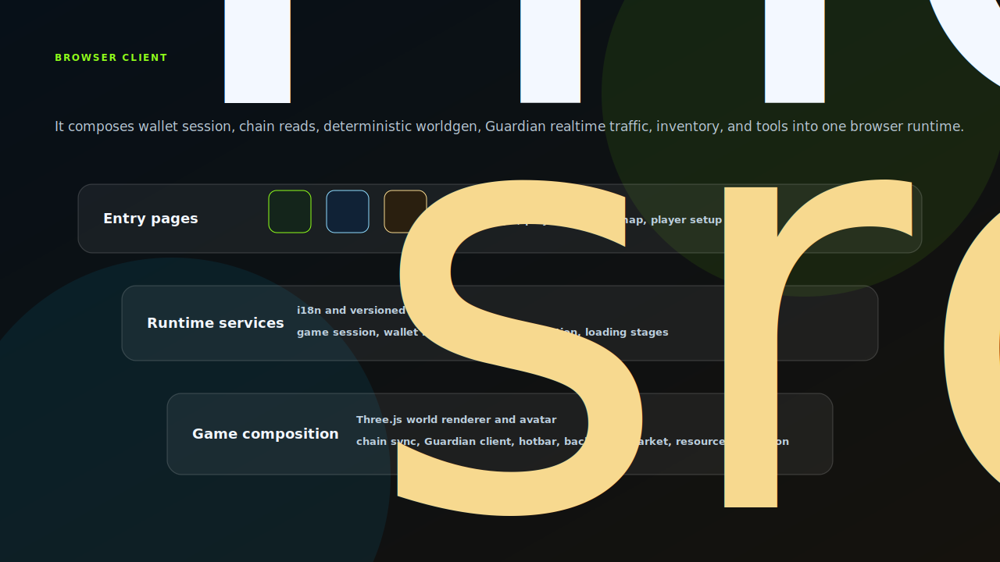

# NiceChunk Web

Browser client, product site, wallet flow, and playable NiceChunk experience.

## Project Overview

This repository contains the primary browser experience for NiceChunk. It includes the product entry points, wallet login, player setup, playable world client, mining, marketplace UI, NCM tooling pages, roadmap pages, and shared browser runtime modules.

The web client sits at the intersection of rendering, wallet identity, deterministic world generation, Guardian realtime connections, and Solana account state. It is the place where the protocol becomes an actual product surface.

The code is intentionally split into feature pages and shared runtime modules so a developer can iterate on gameplay without editing contract documentation or service deployment code.

## Runtime Composition

The web repository is the integration layer, not the final authority for every system it touches. It coordinates wallet session state, versioned i18n, RPC configuration, chain account reads, deterministic world generation, Guardian realtime messages, Three.js rendering, hotbar and backpack state, marketplace UI, NCM tools, and product pages.

That makes `src/main.js` a composition point. It should wire stable modules together, surface loading and failure states clearly, and keep protocol decisions in the program, SDK, worldgen, Guardian, and asset-format repositories where they can be reviewed independently.

## System Principles

- Game first: the first screen should lead users into a functioning world, not just a marketing page.
- Chain-aware but resilient: the client can read public accounts, cache world configuration, and fall back gracefully when RPC is unavailable.
- Feature pages remain modular: login, player setup, roadmap, NCM, NCM-DNA, and gameplay views are kept in separate folders with shared runtime modules.
- Internationalization owns user-visible text: page copy and runtime labels should flow through the locale dictionaries.

## How It Works

- Run the Vite dev server and open the relevant page route for the feature being developed.
- Use the shared i18n and site UI helpers for visible copy, loading states, and header behavior.
- Keep game runtime modules under src/ focused on world rendering, wallet/session state, Guardian connectivity, and chain interaction.
- Validate UI changes in English first, then update locale dictionaries as part of the same product change.

## Why This Project Matters

The web client is the public face of the project. It proves that the chain programs, world generation, Guardian network, and asset formats can operate as a coherent browser game.

Keeping it separate from protocol and service repositories protects development velocity. UI contributors can work on interaction quality while protocol contributors focus on state transitions and account layouts.

## Repository Layout

- `src/`
- `home/`
- `login/`
- `play/`
- `mining/`
- `ncm/`
- `ncm_dna/`
- `public/`

## Development Workflow

1. Clone the repository and inspect the focused source tree before changing shared contracts or generated artifacts.
2. Keep changes scoped to the domain of this repository. Cross-domain changes should be coordinated through the matching split repositories.
3. Run the smallest meaningful validation for the touched surface: build checks for programs, browser checks for pages, or fixture checks for deterministic libraries.
4. Update screenshots and documentation when behavior, visible UI, public constants, or developer-facing workflows change.

## Future Development Direction

- Continue extracting runtime libraries, especially world generation and NCM handling, into reusable packages.
- Harden wallet and session flows around failure states, pending transactions, and mobile wallet handoff.
- Improve marketplace UX with clearer listing states, settlement feedback, and account inspection tools.
- Add automated visual regression screenshots for the main pages before public releases.

## Maintenance Notes

This repository is a focused split from the main NiceChunk working tree. Keep the public surface explicit: avoid committing private keys, wallet files, deployment-only scripts, machine-specific configuration, or generated build artifacts. Runtime user-facing copy should stay behind the i18n layer where the project has an i18n surface.
